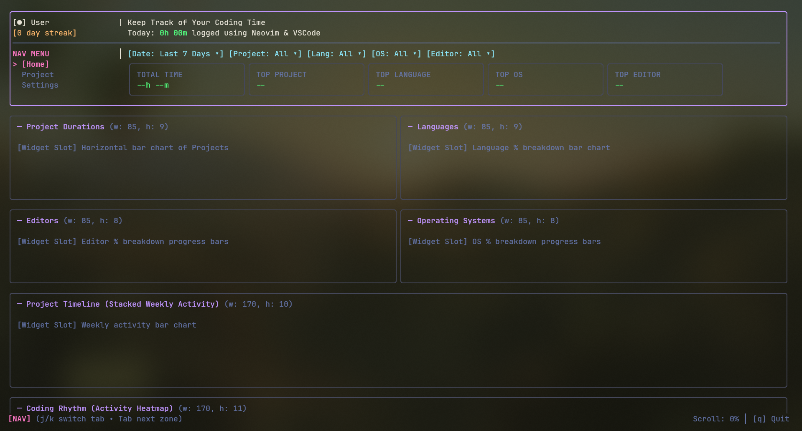

# hackatime-tui

A fast, keyboard-driven terminal dashboard for [Hackatime](https://hackatime.hackclub.com) / WakaTime, built in Go with Bubble Tea v2 and Lip Gloss v2.

Inspired by tools like `btop` and `lazygit`, it uses a pinned header layout with a scrollable card deck below so you can inspect your coding rhythms, top languages, editors, and project breakdowns directly from your terminal.




> umm.. sowwy The real API is not integrated yet... :cwy: But TUI looks sick hehe

---

## Features

- **Split Focus Navigation**: Toggle cleanly between Navigation (`[Home]`), the Filter Bar, and the scrollable Widget Deck.
- **Interactive Dropdowns**: Select and filter by Date range, Project, Language, OS, or Editor directly with keyboard shortcuts.
- **Dracula Palette**: Consistent terminal aesthetic designed to match standard developer setups.
- **Vim + Arrow Keys**: First-class support for `hjkl`, `g`/`G`, page jumps (`ctrl+u`/`ctrl+d`), as well as standard arrow keys.
- **Bubble Tea v2**: Powered by Charm's v2 runtime with deterministic rendering and declarative views.

---

## Keyboard Controls

| Key | Action |
| :--- | :--- |
| `Tab` / `Shift+Tab` | Cycle focus zone (`NAV` -> `FILTERS` -> `DECK`) |
| `h` / `l` or `<-` / `->` | Select filter button in filter bar |
| `Enter` | Open filter dropdown / confirm selection |
| `Esc` | Close dropdown / cancel |
| `j` / `k` or `↑` / `↓` | Scroll widget deck / navigate tabs and dropdown menus |
| `ctrl+u` / `ctrl+d` | Half-page scroll up / down |
| `g` / `G` | Jump to top / bottom of dashboard |
| `q` / `ctrl+c` | Quit |

---

## Architecture & Team Split

We tried making this project as much asynchronously possible as we could. By dividing the stuff into individual folders for ourselves like you can see in
`tree` output below

```text
.
├── cmd/hackatime/main.go     # Binary entrypoint
├── internal/
│   ├── app/                  # (Lead) Root state machine, viewport layout, key routing
│   ├── model/                # Shared domain contracts, data structs, and Bubble Tea msgs
│   └── ui/                   # (Widgets) Lipgloss renderers, charts, gauges, heatmaps
└── pkg/
    └── api/                  # (Backend) HTTP client, auth (~/.wakatime.cfg), Hackatime API
```

- **`internal/app/`**: Coordinates the state machine, handles window resizing, routes keypresses between zones, and wraps the content inside a scrollable Bubble Tea viewport.
- **`pkg/api/`**: Interacts with the Hackatime API (`/users/current/stats/...` and `/users/current/summaries`) using personal API keys.
- **`internal/ui/`**: Pure rendering functions that take structs from `internal/model/` and return styled Lipgloss blocks to plug into the deck slots.

---

## Quickstart

### Prerequisites

- Go `1.22+` (or `1.24+`)
- A Hack Club Hackatime account (with your key in `~/.wakatime.cfg` or set via `HACKATIME_API_KEY`)

### Running Locally

Clone the repo and run the binary:

```bash
git clone https://github.com/three-thirds/hackatime-tui.git
cd hackatime-tui
go run ./cmd/hackatime
```

---

## Roadmap

- [x] Pinned header + scrollable viewport layout engine
- [x] Multi-zone focus state machine (`Nav`, `Filters`, `Deck`)
- [x] Interactive filter dropdowns with keyboard navigation
- [x] Dracula styling and slot dimension constraints
- [ ] Backend API client integration (`pkg/api`)
- [ ] Custom date range modals

---

## License

MIT
